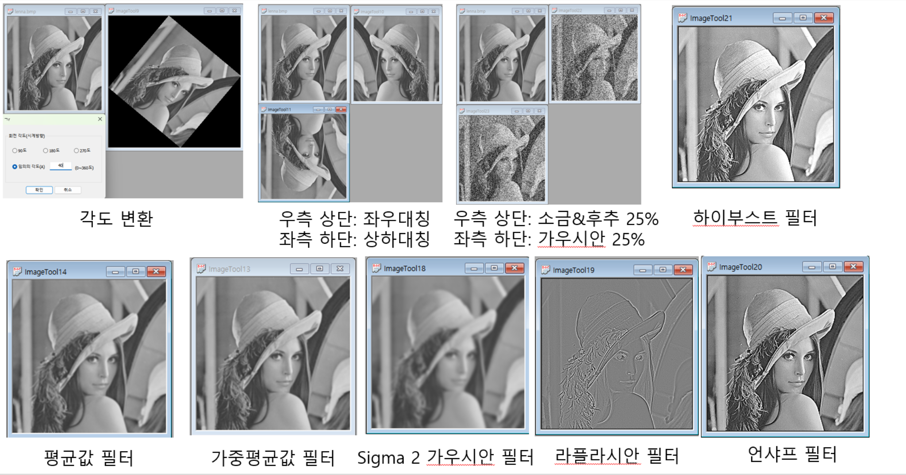
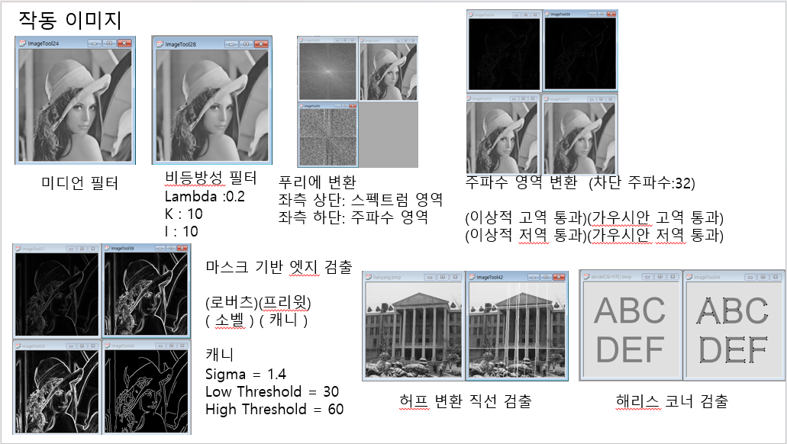
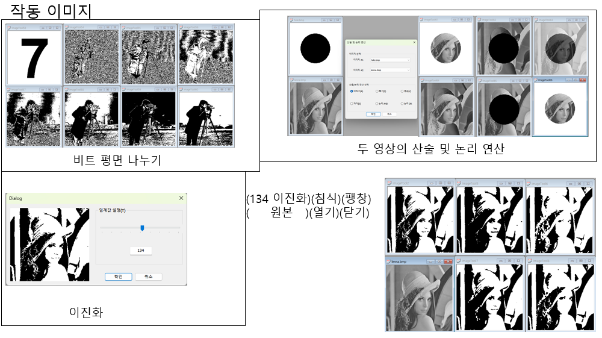
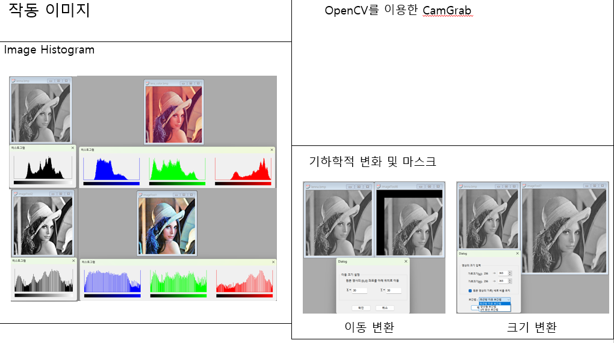

## Demo (Screenshots)

### Basic transforms & filters

### Frequency domain / edges / feature detection

### Bit-plane / arithmetic & bitwise / binarization & morphology

### Histogram / geometric transforms / CamGrab

