# Simple_ImageProcessingTool

MFC 기반의 간단한 영상처리 툴입니다.  
영상처리 기초 학습을 목적으로 시작했으며, 기본 변환/필터/주파수 영역 처리/엣지·특징 검출을 직접 구현하며 정리했습니다.

## 목표
- 영상처리 기본 연산(기하 변환, 필터링, FFT, 엣지/특징 검출, 이진화/모폴로지)을 구현하며 개념 정리
- 결과를 스크린샷으로 남기고, 파라미터(임계값/시그마/차단 주파수 등)를 함께 기록

## CamGrab (카메라 입력)
현재는 OpenCV를 이용해 PC 카메라 프레임을 받아와 표시/처리합니다.

### Roadmap
- [ ] OpenCV 의존 없이 카메라 프레임 수신 시도  
  - Windows: DirectShow / Media Foundation 기반 캡처
  - (환경에 따라) V4L2 등 네이티브 캡처 방식으로 확장
- [ ] 입력 프레임을 동일 파이프라인(필터/엣지/FFT)에 연결해 실시간 처리

## 주요 기능
- 기하 변환: 회전 / 대칭(좌우·상하) / 이동 / 크기 변환
- 잡음: 소금&후추 / 가우시안
- 공간 영역 필터: 평균/가중평균/가우시안/미디언/라플라시안/언샤프/하이부스트/비등방성
- 주파수 영역: 푸리에 변환 및 저역·고역 통과(이상적/가우시안)
- 엣지/특징: Roberts/Prewitt/Sobel/Canny, Hough line, Harris corner
- 기타: 비트 평면 분해, 산술·논리 연산, 이진화 및 모폴로지(침식/팽창/열기/닫기), 히스토그램/평활화

## 결과 화면 (Screenshots)

<b>히스토그램 / 평활화</b>

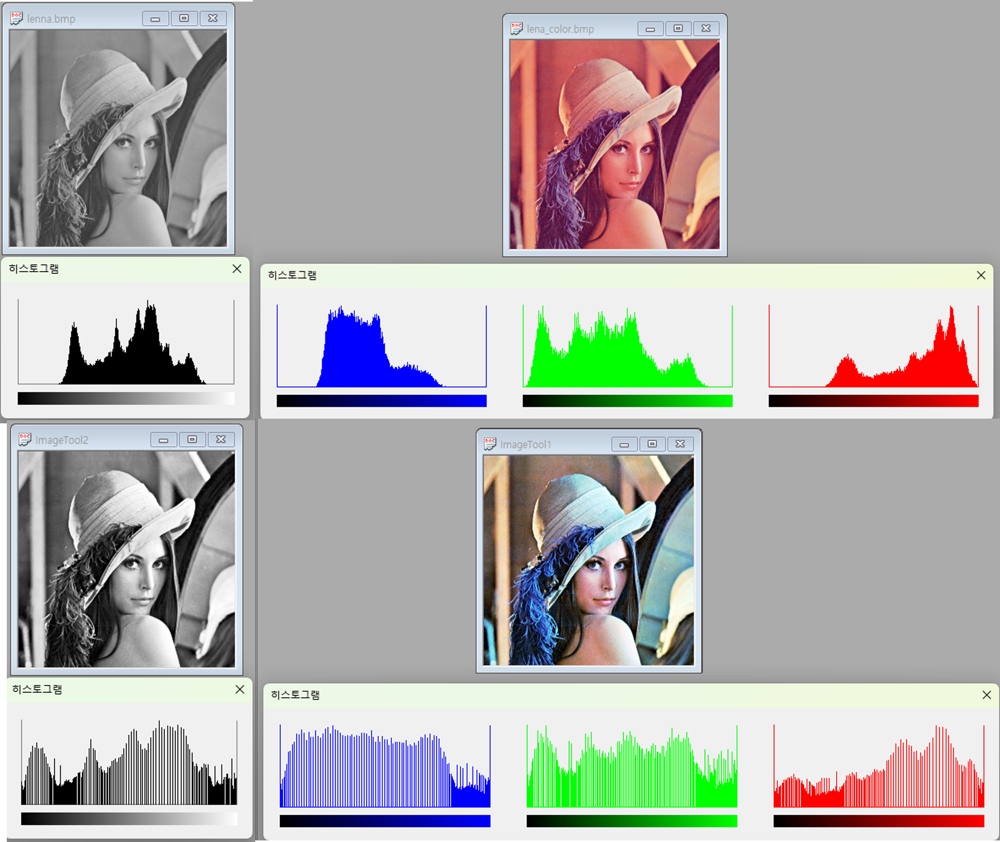

<ul>
  <li>그레이/컬러 영상의 히스토그램(RGB 채널별) 및 평활화 결과 비교</li>
</ul>

<b>기하 변환</b>

<table>
  <tr>
    <td align="center"><b>회전(각도 40°)</b> 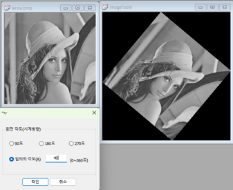</td>
    <td align="center"><b>대칭(좌우 / 상하)</b> 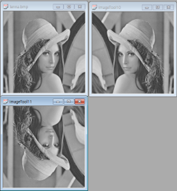</td>
  </tr>
  <tr>
    <td align="center"><b>이동 변환</b> 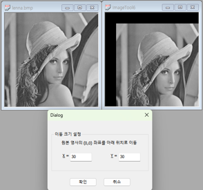</td>
    <td align="center"><b>크기 변환(리사이즈)</b> 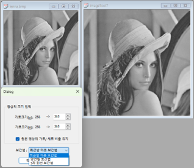</td>
  </tr>
</table>

<ul>
  <li><b>좌우 대칭</b>: (원본, 좌우)</li>
  <li><b>상하 대칭</b>: (원본, 상하)</li>
  <li><b>flip_lr_ud.png</b> 배치
    <ul>
      <li>좌측 상단: 원본</li>
      <li>우측 상단: 좌우대칭</li>
      <li>좌측 하단: 상하대칭</li>
    </ul>
  </li>
</ul>

<b>잡음(Noise) 추가</b>

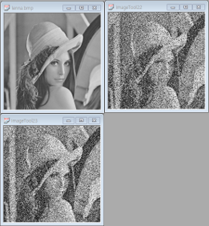

<ul>
  <li>우측 상단: <b>소금&amp;후추 잡음 25%</b></li>
  <li>좌측 하단: <b>가우시안 잡음 25%</b></li>
</ul>

<b>공간 영역 필터(Spatial Filters)</b>

<table>
  <tr>
    <td align="center"><b>평균값 필터</b> 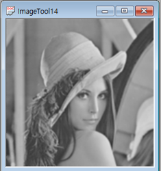</td>
    <td align="center"><b>가중 평균값 필터</b> 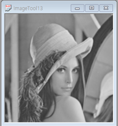</td>
  </tr>
  <tr>
    <td align="center"><b>가우시안 필터 (sigma=2)</b> 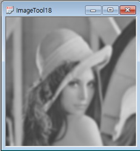</td>
    <td align="center"><b>미디언 필터</b> 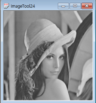</td>
  </tr>
  <tr>
    <td align="center"><b>라플라시안 필터</b> 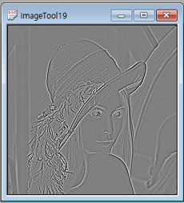</td>
    <td align="center"><b>언샤프(샤프닝)</b> 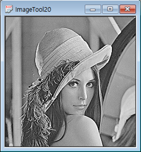</td>
  </tr>
  <tr>
    <td align="center"><b>하이부스트 필터</b> 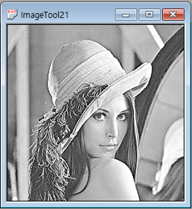</td>
    <td align="center"><b>비등방성(Anisotropic) 필터</b> 
      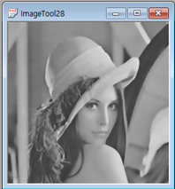
       lambda=0.2, K=10, 반복=10
    </td>
  </tr>
</table>

<b>푸리에 변환(주파수 영역) &amp; 주파수 필터링</b>

<table>
  <tr>
    <td align="center"><b>푸리에 변환 화면</b> 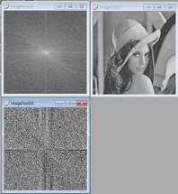</td>
    <td align="center"><b>주파수 영역 필터(차단 주파수=32)</b> 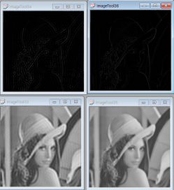</td>
  </tr>
</table>

<ul>
  <li><b>fft_views.png</b> 배치
    <ul>
      <li>좌측 상단: <b>스펙트럼 영역</b></li>
      <li>좌측 하단: <b>주파수 영역</b></li>
    </ul>
  </li>

  <li><b>freq_filters_fc32.png</b> 배치 (차단 주파수 32)
    <ul>
      <li>좌측 상단: <b>이상적 고역통과(HPF)</b></li>
      <li>우측 상단: <b>가우시안 고역통과(HPF)</b></li>
      <li>좌측 하단: <b>이상적 저역통과(LPF)</b></li>
      <li>우측 하단: <b>가우시안 저역통과(LPF)</b></li>
    </ul>
  </li>
</ul>

<b>엣지(Edge) 검출</b>

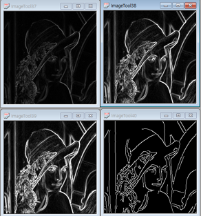

<ul>
  <li>로버츠(Roberts) / 프리윗(Prewitt) / 소벨(Sobel) / 캐니(Canny) 결과 비교</li>
  <li><b>캐니 파라미터</b>: sigma = <b>1.4</b>, low threshold = <b>340</b>, high threshold = <b>60</b></li>
</ul>

<b>특징(Feature) 검출</b>

<table>
  <tr>
    <td align="center"><b>허프 변환 직선 검출</b> 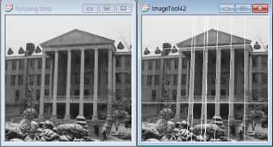</td>
    <td align="center"><b>해리스 코너 검출</b> 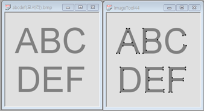</td>
  </tr>
</table>

<b>비트 평면 / 산술·논리 연산 / 이진화·모폴로지</b>

<table>
  <tr>
    <td align="center"><b>비트 평면 나누기</b> 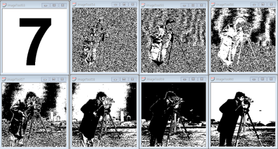</td>
    <td align="center"><b>두 영상 산술·논리 연산(UI)</b> 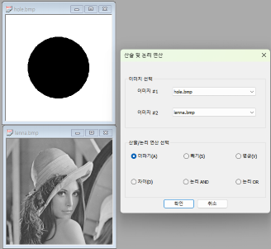</td>
  </tr>
  <tr>
    <td align="center" colspan="2"><b>산술·논리 연산 결과</b> 
      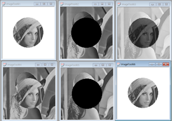
    </td>
  </tr>
</table>

<table>
  <tr>
    <td align="center"><b>이진화</b> 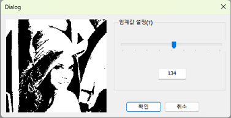
       임계값(threshold) = 134
    </td>
    <td align="center"><b>모폴로지 연산</b> 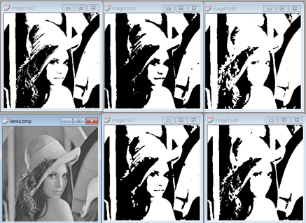</td>
  </tr>
</table>

<ul>
  <li><b>morphology_erode_dilate_open_close.png</b> 배치
    <ul>
      <li>왼쪽: <b>이진화 → 침식(Erosion) → 팽창(Dilation)</b></li>
      <li>오른쪽: <b>원본 → 열기(Opening) → 닫기(Closing)</b></li>
    </ul>
  </li>
</ul>

